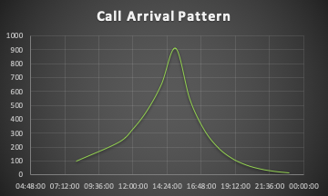

# Erlang Python Library How-To

The Erlang Library can be used to forecast various important metrics in a contact center operation.
This library is written so that it can be used for both, **voice** and **non-voice** forecasting.
Voice means phone calls or video calls, whereas non-voice means chat, messenger, email, and other social media channels. [ Go back to the Readme document](README.MD])

## Why the distinction?

A typical agent can handle 1 call but can handle more than 1 chat or social media transaction.
To reflect this fact, the Erlang Library uses the `nv` flag and the `ccc` parameters to enable this special case calculation.
Internally, the Library will do th following:
If `nv == True` and `ccc > 1` then the library will take the Average Incident Handle Time `AIT` and divide it by `ccc`.
For example, if, in a chat session, the AIT is 300 seconds and the agent can handle 3 chats at the same time, dividing AIT/3 results in a new handle time of 100 seconds. This can be done, as the agent has to wait for the customer to do things advised to be done. While waiting, the agent can instruct another customer in a chat session to take some action and switch to the next case or back to the previous one. The effect of this is the same as having 3 agents, with the only difference, that the After Incident Wrap-up Time has to be multiplied by `ccc` to be correct.
So, having said that, there are two configurations that the Erlang-C Library supports, and the user of the Library can control the calculations with `nv and ccc`.

In the following the two different scenarios are detailed.

---

## Scenario-A - Phone Support

### What we know

We make the following assumptions based on some historical data we assume we have:
- We need to plan for a new call center that operates in 2 shifts for **16 hours** every day.
- The call center receives calls following a standard distribution (Bell Curve).
- The call volume starts in the morning at 100 calls and increases to ~900 calls, then it decreases back to 100 calls in the last hour.
- The call center starts operation at **08:00 hours** and finishes operations at **24:00 hours**.
- The average call duration is **5 minutes or 300 seconds**.
- The agents have to do some after call work that will last **40 seconds** each time.
- The Service Level we assume for this call center is **80% of calls need to be answered in 30 seconds**.
- Furthermore, we assume that customers will hang up if they have to wait for more than **20 seconds** to be put through to an agent.
- We define the maximum wait time in the system as **30 seconds**.
- We want to calculate the various parameters with a **1 hour interval**.

#### Call Volume Data

| Time    | Call Volume |
| :---    |    :----:   |
| 08:00   | 100         |
| 09:00   | 120         |
| 10:00   | 168         |
| 11:00   | 236         |
| 12:00   | 331         |
| 13:00   | 464         |
| 14:00   | 650         |
| 15:00   | 910         |
| 16:00   | 546         |
| 17:00   | 328         |
| 18:00   | 197         |
| 19:00   | 119         |
| 20:00   | 72          |
| 21:00   | 44          |
| 22:00   | 27          |
| 23:00   | 17          |

Here is a graph with the call arrival pattern.



### What we would like to know

1. How many phone lines (trunks) would we have to provide to manage the peak call volume.
2. How many agents do we need in total to run this contact center.
3. How many calls would be put into the queue on average.
4. What would the average queue wait time be at different intervals.
5. What would the level of service be under the assumptions we made.
6. What would the utilisation of the agents be at various intervals.

With these assumptions we can now define our variables that need to be passed to the constructor of the class.

```Python
import erlang-c

# Create object from Erlang_C class
# (SLA, TTA, ATT, ACW, ABNT, MAX_WAIT, NV, CCC, INTERVAL, OPS_HRS)
ec = erlang_c.Erlang(0.80, 30, 300, 40, 20, 30, False, 1, 60, 16)

# We want to know how many trunks we need with these parameters
# So we first need to find the maximum number of agents, which we do by using the highest call volume.
agents = ec.Agents(30, 910)
# result: 93

# with the agent count we can now determine the trunk lines needed
trunks = ec.Trunks(agents, 910)
# result: 117

# Now let's determine the queue size for the peak Volume
qd_calls = ec.Queued(agents, 910)
#result: 35%

# What is the average queue wait time?
q_time = ec.QueueTime(agents, 910)
#result: 48 seconds

# What would be the actual service level?
ec.SLA(agents, 910, 30)
# result: 81.2%

# what would be teh agent utilisation
util = ec.Utilisation(agents, 910)
# result 92.41% <-- this is way too high, so we would have to tweak agent count.
```

To get the agent numbers and parameters for the rest of the shift one would loop through the functions above with the call volumes in the [table provided above](#call-volume-data). Here is the complete test code:
```Python
import erlang_c

# Create object from Erlang_C class
# (SLA, TTA, ATT, ACW, ABNT, MAX_WAIT, NV, CCC, INTERVAL, OPS_HRS)
ec = erlang_c.Erlang(0.80, 30, 300, 40, 20, 30, False, 1, 60, 16)
service_time = 30
call_data = [["08:00", 100], ["09:00", 120], ["10:00", 168], ["11:00", 236], ["12:00", 331], ["13:00", 464], ["14:00", 650], ["15:00", 910], ["16:00", 546], ["17:00", 328], ["18:00", 197], ["19:00", 119], ["20:00", 72], ["21:00", 44], ["22:00", 27], ["23:00", 17]]
max_call_vol = 0
idx = 0
count = 0
# find the maximum call volume to determine maximum trunk lines
for x in call_data:
    if x[1] > max_call_vol:  
        max_call_vol = x[1]
        idx = count
    count += 1

agents = ec.Agents (service_time, max_call_vol)

print ("\n-- Calculations for maximum volume --\n")
x = call_data[idx]
print ("Largest Call Volume found at {} with {} calls.".format(x[0], x[1]))
print ("\nUsing largest call volume {} for next calculations...\n".format(x[1]))
print ("Agents:         {}".format(agents))
print ("Utilisation:    {:0.2f}".format(ec.Utilisation(agents, max_call_vol) * 100))
print ("Trunks:         {}".format(ec.Trunks(agents, max_call_vol)))
print ("SLA:            {:0.2f}".format(ec.SLA(agents, max_call_vol, service_time) * 100))
print ("ASA:            {}sec".format(ec.ASA(agents, max_call_vol)))
print ("Abandoned:      {:0.2f}".format(ec.Abandon(agents, max_call_vol) * 100))
print ("Queued:         {:0.2f}".format(ec.Queued(agents, max_call_vol) * 100))
print ("Queue Time      {}sec".format(ec.QueueTime(agents, max_call_vol)))
print ("Queue Size      {}".format(ec.QueueSize(agents, max_call_vol)))

print ("\nCalculating data set...\n")
print ("Time   Agents  Utilisation SLA       ASA     Abandoned   Queued    Queue-Time  Queue-Size")
print ("-----------------------------------------------------------------------------------------")
for x in call_data:
    tm = x[0]
    ag = ec.Agents (service_time, x[1])
    ut = ec.Utilisation(ag, x[1]) * 100
    sla = ec.SLA(ag, x[1], service_time) * 100
    asa = ec.ASA(ag, x[1])
    abn = ec.Abandon(ag, x[1]) * 100
    qc = ec.Queued(ag, x[1]) * 100
    qt = ec.QueueTime(ag, x[1])
    qs = ec.QueueSize(ag, x[1])
    print ("{}  {}      {:0.2f}%      {:0.2f}%    {:0}sec   {:0.2f}%      {:0.2f}%    {}          {}".format(tm, ag, ut, sla, asa, abn, qc, qt, qs))
print ()
```

The result should look like the output below:
```
Time   Agents  Utilisation SLA       ASA     Abandoned   Queued    Queue-Time  Queue-Size
-----------------------------------------------------------------------------------------
08:00  13      72.65%      84.80%    20sec   16.88%      20.81%     96         1
09:00  15      75.56%      83.50%    21sec   18.38%      22.80%     93         1
10:00  20      79.33%      83.23%    20sec   18.94%      24.15%     82         1
11:00  27      82.55%      83.36%    18sec   19.12%      25.22%     72         1
12:00  37      84.49%      85.73%    14sec   16.90%      23.69%     59         1
13:00  50      87.64%      84.26%    15sec   18.88%      27.16%     55         2
14:00  68      90.28%      82.71%    16sec   21.00%      30.99%     51         3
15:00  93      92.41%      81.22%    17sec   23.11%      35.00%     48         4
16:00  58      88.91%      83.75%    15sec   19.64%      28.67%     53         2
17:00  36      86.05%      81.45%    20sec   21.50%      28.90%     68         2
18:00  23      80.89%      83.28%    19sec   19.03%      24.64%     77         1
19:00  15      74.93%      84.45%    20sec   17.37%      21.67%     90         1
20:00  10      68.00%      85.48%    20sec   15.95%      19.26%    106         0
21:00   7      59.37%      87.70%    19sec   13.37%      15.81%    120         0
22:00   5      51.00%      88.78%    19sec   12.06%      13.93%    139         0
23:00   4      40.14%      92.58%    13sec    7.96%       9.16%    142         0
```

That's all folks.

---

## Scenario-B - Chat Support

### What we know

We make the following assumptions based on some historical data we assume we have:
- We need to plan for a new chat support center that operates in 2 shifts for **16 hours** every day.
- The chat support center receives calls following a standard distribution (Bell Curve), we will use the same data as above.
- The chat volume starts in the morning at 100 chats and increases to ~900 chats, then it decreases back to 100 chats in the last hour.
- The chat support center starts operation at **08:00 hours** and finishes operations at **24:00 hours**.
- The average chat duration is **5 minutes or 300 seconds**.
- The agents have to do some after chat work that will last **40 seconds** each time.
- The Service Level we assume for this chat support center is **80% of chats need to be answered in 30 seconds**.
- Furthermore, we assume that customers will abandon the chat if they have to wait for more than **20 seconds** before an agent answers.
- We define the maximum wait time in the system as **30 seconds**.
- We want to calculate the various parameters with a **1 hour interval**.

### What we would like to know

1. How many agents do we need in total to run this contact center.
2. How many calls would be put into the queue on average.
3. What would the average queue wait time be at different intervals.
4. What would the level of service be under the assumptions we made.
5. What would the utilisation of the agents be at various intervals.

Here is the code for this test:

```Python
# Create new object from Erlang_C class
# (SLA, TTA, ATT, ACW, ABNT, MAX_WAIT, NV, CCC, INTERVAL, OPS_HRS)
ec = erlang_c.Erlang(0.80, 30, 300, 40, 20, 30, True, 3, 60, 16)

service_time = 30
call_data = [["08:00", 100], ["09:00", 120], ["10:00", 168], ["11:00", 236], ["12:00", 331], ["13:00", 464], ["14:00", 650], ["15:00", 910], ["16:00", 546], ["17:00", 328], ["18:00", 197], ["19:00", 119], ["20:00", 72], ["21:00", 44], ["22:00", 27], ["23:00", 17]]
max_call_vol = 0
idx = 0
count = 0
for x in call_data:
    if x[1] > max_call_vol:  
        max_call_vol = x[1]
        idx = count
    count += 1

agents = ec.Agents (service_time, max_call_vol)

ec.print_info()

print ("\n-- Calculations for maximum call volume --\n")
x = call_data[idx]
print ("Largest Call Volume found at {} with {} calls.".format(x[0], x[1]))
print ("\nUsing largest call volume {} for next calculations...\n".format(x[1]))
print ("Agents:         {}".format(agents))
print ("Utilisation:    {:0.2f}".format(ec.Utilisation(agents, max_call_vol) * 100))
print ("SLA:            {:0.2f}".format(ec.SLA(agents, max_call_vol, service_time) * 100))
print ("ASA:            {}sec".format(ec.ASA(agents, max_call_vol)))
print ("Abandoned:      {:0.2f}".format(ec.Abandon(agents, max_call_vol) * 100))
print ("Queued:         {:0.2f}".format(ec.Queued(agents, max_call_vol) * 100))
print ("Queue Time      {}sec".format(ec.QueueTime(agents, max_call_vol)))
print ("Queue Size      {}".format(ec.QueueSize(agents, max_call_vol)))

print ("\nCalculating data set...\n")
print ("Time   Agents  Utilisation SLA       ASA     Abandoned   Queued    Queue-Time  Queue-Size")
print ("-----------------------------------------------------------------------------------------")
for x in call_data:
    tm = x[0]
    ag = ec.Agents (service_time, x[1])
    ut = ec.Utilisation(ag, x[1]) * 100
    sla = ec.SLA(ag, x[1], service_time) * 100
    asa = ec.ASA(ag, x[1])
    abn = ec.Abandon(ag, x[1]) * 100
    qc = ec.Queued(ag, x[1]) * 100
    qt = ec.QueueTime(ag, x[1])
    qs = ec.QueueSize(ag, x[1])
    print ("{}  {}      {:0.2f}%      {:0.2f}%    {:0}sec   {:0.2f}%      {:0.2f}%    {}          {}".format(tm, ag, ut, sla, asa, abn, qc, qt, qs))
print ()
```

And here are the results, which differ from the previous example based on the fact that agents are able to handle more than one transaction concurrently.
```
Time   Agents  Utilisation SLA       ASA     Abandoned   Queued    Queue-Time  Queue-Size
-----------------------------------------------------------------------------------------
08:00   9      67.90%      85.62%    16sec   16.39%      21.32%     76          0
09:00  10      73.33%      80.79%    23sec   21.69%      27.64%     83          1
10:00  14      73.33%      87.75%    12sec   14.52%      20.39%     59          1
11:00  18      80.12%      82.70%    17sec   20.35%      28.18%     61          1
12:00  24      84.28%      80.61%    19sec   23.02%      32.43%     58          2
13:00  33      85.93%      83.87%    14sec   19.93%      30.39%     47          2
14:00  45      88.27%      84.56%    13sec   19.62%      31.70%     42          2
15:00  61      91.17%      82.03%    15sec   22.96%      37.47%     41          4
16:00  38      87.81%      82.11%    16sec   22.09%      33.66%     47          2
17:00  24      83.52%      82.33%    17sec   21.15%      30.31%     56          2
18:00  16      75.24%      87.83%    12sec   14.57%      20.88%     56          1
19:00  10      72.72%      81.68%    21sec   20.74%      26.58%     81          1
20:00   7      62.86%      86.05%    17sec   15.70%      19.88%     85          0
21:00   5      53.78%      87.88%    16sec   13.46%      16.61%     95          0
22:00   4      41.25%      92.78%    9sec     8.03%       9.95%     94          0
23:00   3      34.63%      92.36%    11sec    8.35%       9.98%    112          0
```
To go back to the Readme document click [here](README.MD])